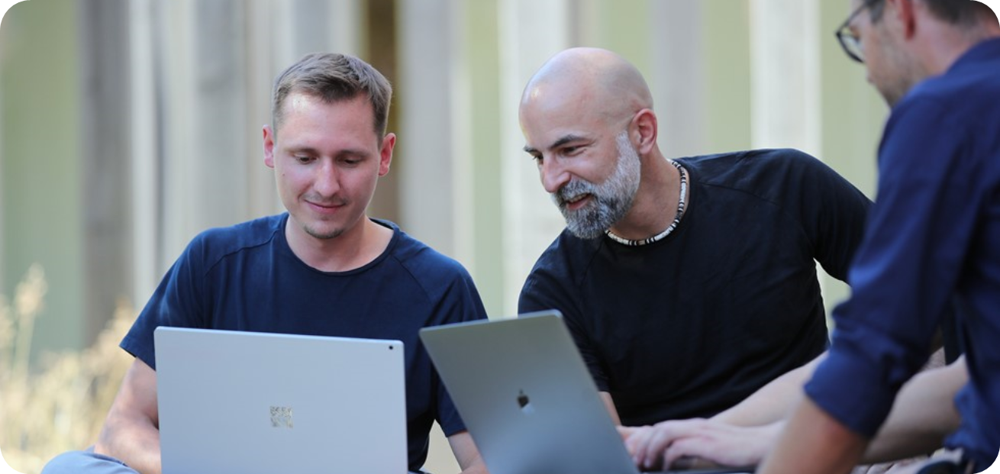
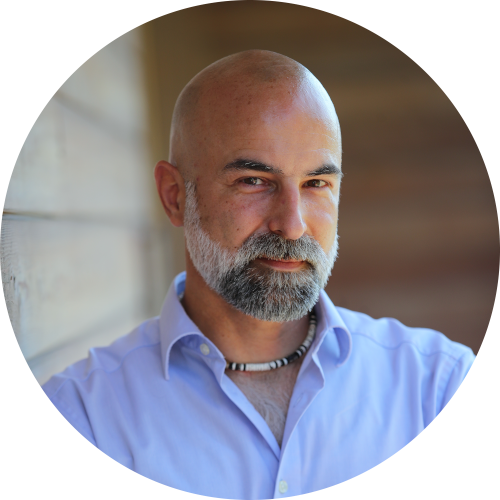
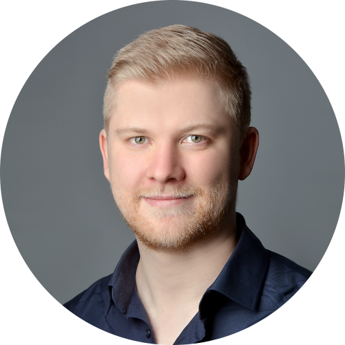
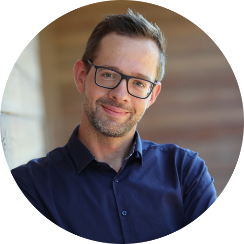
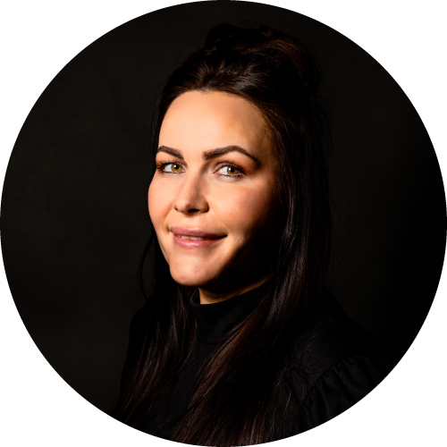
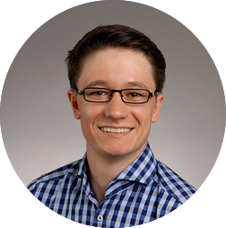
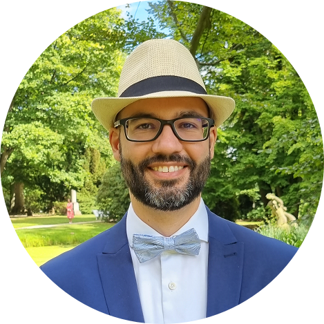
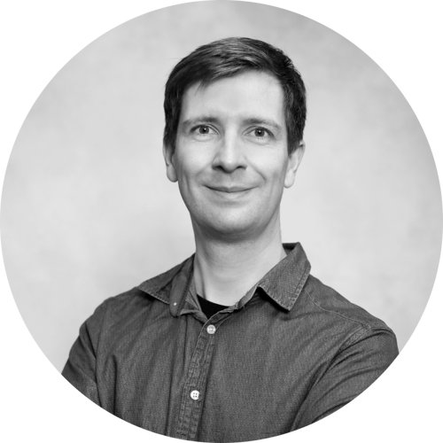
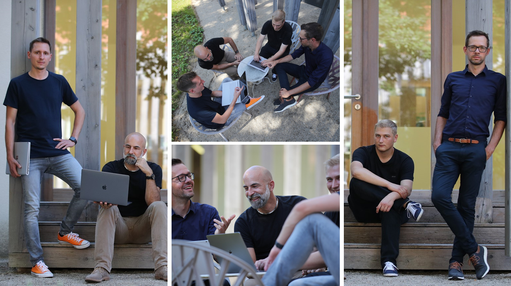

Als Entwicklungsteam mit mehrjähriger Erfahrung in der Immobilienbranche haben wir die dortigen Herausforderungen erkannt und arbeiten gemeinsam an einer innovativen Plattform, um diese mit **Automatisierung** und **Vernetzung** zu lösen.

Die Cloud Klabauter sind ein Start-up der DOMUS Software AG und wurden 2020 gegründet. Mit mehr als 45 Jahren Erfahrung in der Entwicklung on Immobilienlösungen ist die DOMUS Software AG der Marktführer im Mittelstand. Unser Ziel ist die Entwicklung von modernen Lösungen in Zusammenarbeit mit namhaften Partnern aus der Immobilienbranche.

---

## SO ARBEITEN WIR

Die Cloud Klabauter leben von Anfang an eine Remote Kultur.
Unsere Lösungen profitieren vom Einsatz aktueller Technologien und durch die langjährigen Erfahrung in der Entwicklung von Cloud Services.

**Flexibilität und Teamwork sind unsere Stärken!**

Unter anderem erwartet dich bei uns `Remote Work`, `Flexible Arbeitszeiten`, `Monatlicher Kaffeevorrat`, `Persönliches Weiterbildungsbudgets` und `Moderne Hardware`

---

## UNSER TEAM

### Thomas | `Backend Developer`

> **Über mich:** - Softwaredeveloper, Klabauter

> **TechStack:** `.NET`, `C#`, `k8s`, `PowerShell`, `terraform`, `pulumi`, `azure`, `WPF` ...

> **Was mag ich an den Klabautern?:** Arbeiten mit modernen Technologien und tolle Kollegen, mit denen man sich immer wieder herausfordern kann

---

### Michael | `Backend Developer`

> **Über mich:** Software-Developer, Klabauter

> **TechStack:** `.NET`, `C#`, `k8s`, `pulumi`, `azure`, `WPF` ...

> **Was mag ich an den Klabautern?:** Den Drive, mit modernsten Technologien etwas Großes zu erreichen. Ein hervorragendes Team und Unternehmensstruktur. Viel Freiheit und gute Arbeitsbedingungen.

---

### Robert | `Frontend Developer`

> **Über mich:** I ❤️ to work with React, Node.js, GraphQL & Azure. Fullstack Technology Enthusiast is the best description for me

> **TechStack:** `react`, `typescript`, `nodejs`, `graphql`, `c#`, `azure`, `aws`, `.net`, ...

> **Was mag ich an den Klabautern?:** Flexibilität, Remote Work, stabiles Team & spannende Herausforderungen

---

### Britta | `Product Owner`

> **Über mich:** Extroverted introvert

> **TechStack:** `umm.....`, ...

> **Was mag ich an den Klabautern?:** Die gute Mischung aus Menschen, die ihren Job gerne gut machen, schafft eine Arbeitsatmosphäre, die ihresgleichen sucht.

---

### Joachim | `Backend Developer`

> **Über mich:** Softwaredeveloper, Klabauter, gerne draußen

> **TechStack:** `.NET`, `C#`, `WPF`, `docker`, `typescript`, `nodejs`, `angular`, `CI/CD` ...

> **Was mag ich an den Klabautern?:** Super Kollegen mit dem Willen gemeinsam etwas Großes zu schaffen, Remote Work

---

### Michael | `Backend Developer`

> **Über mich:** Softwaredeveloper, Motorrad, Outdoors, Eherenamt

> **TechStack:** `.NET`, `C#`, `DevOps`, `CI/CD`, `CosmosDb`, `docker` ...

> **Was mag ich an den Klabautern?:** Klasse Arbeitsumfeld, super Kollegen mit denen man Wert für den Kunden schaffen kann, persönliche Weiterentwicklung.

---

### Stefan | `Frontend Developer`

> **Über mich:** Software developer and media designer, camping, mountain biking, playing ball games with the labrador furry friend

> **TechStack:** `React`, `TypeScript/JavaScript`, `Node.js`, `GraphQL/Apollo`, `Cloud technologies`, ...

> **Was mag ich an den Klabautern?:** I am particulary enthusiastic about the modern working environment, the use of the latest technologies to create exciting software products and the creative exchange with colleagues.

---

## UNSER SPEKTRUM

Der [Developer Open Space](https://devopenspace.de) ist ein Communityevent in Leipzig für und von Software Entwicklern. Jährlich werden verschiedene Workshops angeboten. Die Technologien und Methodiken aus folgenden Workshops finden auch in unseren Projekten Verwendung.

- Infrastructure as Code mit Pulumi
- Kubernetes für Entwickler & DevOps (Grundlagen)
- Kubernetes für Entwickler (Erweitert)
- Scrum für Scrum Master
- Scrum für Product Owner
- Der REST hinter POST und GET – über Hypermedia, HATEOAS, API-Design und Co
- ASP.NET Core 7
- GraphQL mit HotChocolate und Apollo
- Monitoring für DevOps
- Von ES6 bis ESNext – JavaScript-Features, die ihr kennen müsst!
- ASP.NET Core Health Checks
- AWS DevOps

---

## WIR BRAUCHEN DICH

Wenn du dich auf einer der folgenden Positionen wiederfindest oder auf einer die du hier nicht finden kannst, dann freuen wir uns eine Nachricht von dir!

> 🧑‍💻 [Devops Engineer (M/W/D) | 50-100% | REMOTE](DEVOPS_ENGINEER.md)  
> 🧑‍💻 [Senior Cloud Engineer (M/W/D) | 100% | REMOTE](SENIOR_CLOUD_ENGINEER.md)  
> 🧑‍💻 [Senior Developer (M/W/D) | 100% | REMOTE](SENIOR_DEVELOPER.md)  
> 🧑‍💻 [Test Automation Engineer (M/W/D) | 50-100% | REMOTE](TEST_AUTOMATION_ENGINEER.md)  
> 🧑‍💻 [Fullstack Developer (M/W/D) | 100% | REMOTE](FULLSTACK_DEVELOPER.md)  
> 🧑‍💻 [Frontend Developer (M/W/D) | 50-100% | REMOTE](FRONTEND_DEVELOPER.md)

---

